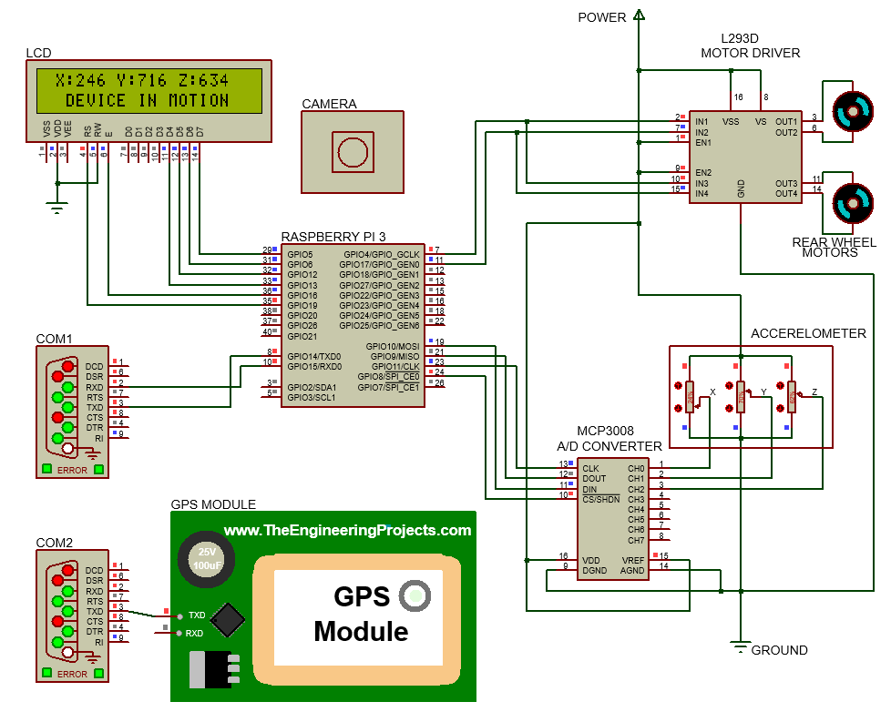

# Railway-Track-Condition-Monitoring-System

## Block Diagram
The railway track condition monitoring device is design to detect any defects in the surface structure of the railway tracks and send appropriate data to the web server on detecting a fault. It uses an accelerometer to sense the bumps, dips and vibrations felt by the device to identify any damage to the track surface. Upon detecting a possible fault area, the system takes an image of the track surface and uses machine learning to identify if the track is damaged and send the image with the type of damage identified along with the current location of the device to the web server. A block diagram of the proposed model is given below along with a brief explanation of the major components to be used in the development of the said model.

## Working Principle
The proposed track condition monitoring device is designed to run along the railway tracks and search for any defects on the track surface. To achieve this objective the device uses an accelerometer to sense any sort of dents, dips, cracks, or gaps in the tracks by detecting the vibrations felt by the device that are caused by the damaged track. When damage is detected by the device, the motors take a halt and the camera takes a picture of the surface of the track which is then used by the damage detection model to find out if the track is damaged and the type of damage found, like rust, or cracks and dents. In case of a damage, all the collected information is sent to the web server, then the motors restart and the device resumes its functions.

## Track Defect Detection Model
The machine learning model used to determine whether the track surface is actually damaged or not is developed in Python using tools and technologies like TensorFlow, Keras, OpenCV, etc. The defect detection model is a modified version of the MobileNetV2 model with a few extra layers appended to it accordingly to our specific needs. MobileNetV2 is a convolutional neural network architecture that seeks to perform well on mobile devices.

To train the machine learning model a small track surface image dataset is used. The dataset contains equal number of defective and non-defective track surface images taken under different lighting conditions. Exact number of images present in the dataset are given in the table below. A few examples of the defective and non-defective track surface images are shown in the figures below. All the images in the dataset are of the same type, JPG and of the same dimension of 55 x 110. 

  <table>
    <caption>Track surface image dataset statistics</caption>
    <tr>
      <th>Category</th>
      <th>Size</th>
    </tr>
    <tr>
      <td>Defective Track Surface Images</td>
      <td>430</td>
    </tr>
    <tr>
      <td>Non-Defective Track Surface Images</td>
      <td>430</td>
    </tr>
    <tr>
      <th align="right">Total Track Surface Images</th>
      <th>960</th>
    </tr>
  </table>
  
   Examples of defective track surface image  
   Examples of non-defective track surface image

After the training and testing phase of the model, the loss and accuracy metrics of the model is shown using the graph.

## Proteus Design
The circuit diagram for the proposed track condition monitoring system is designed and simulated using Proteus. The Raspberry Pi 3 is chosen as the controller unit of the system.

## Simulation
All testing and simulation for the proposed track condition monitoring system is done using Proteus, Virtual Serial Port Emulator, Python and XAMPP. To run the simulations -

  1. Install XAMPP and start the Apache and the phpMyAdmin servers
  2. Create a new database 'hsr' and import the 'hsr.sql' file
  3. Install VSPE and start virtual serial ports 'COM1' and 'COM2'
  4. Install Python 3 
  5. Open the terminal and run the command 'pip3 install -r requirements.txt' to install all the required Python Libraries
  6. Extract 'dataset.rar'
  7. Launch the 'script.py' Python script and keep it running in the background
  8. Open the Proteus design file and start the simulation
  9. Change the accelerometer sensor vaules for different results
